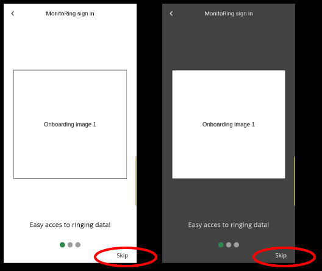

# MonitoRing


This is a student project, with the main goal of researching bird ringing data management practices and building a high-fidelity, horizontal prototype of a mobile application used in the management of bird ringing data in fieldwork conditions.

## Table of Contents

- [MonitoRing](#monitoring)
  - [Table of Contents](#table-of-contents)
  - [MonitoRing Description](#monitoring-description)
    - [Continuous Development](#continuous-development)
  - [Install and run](#install-and-run)
  - [How to use](#how-to-use)
  - [Testing](#testing)
  - [Licence](#licence)
    - [References](#references)

## MonitoRing Description

The application allows bird ringers:

- manage rings (or bands)
- enter bird ringing session data
- enter and manage bird ringing data
- enter and manage re-catch data

The logic in the application draws heavily from EURING Exchange Code 2020 [[1]](#1). Data management relies on forms and local data persistence library [[2]](#2). The application has been developed using the Dart language and Flutter framework. The framework has been used to allow for single codebase, to be used on Android and iOS devices.

### Continuous Development

WARNING! Even though the prototype is in a working condition, with ability to run accross devices, there are MISSING FEATURES and dead ends. The design and codebase have been developed by one person, this effort is continuous...

## Install and run

The latest version of Flutter used to run and test the application is version 3.16.9, with Dart SDK version: 3.2.6.

After downloading the codebase and placing it at a chosen directory, the application can be run:

Add and enable a device the application to be run on, e.g.:

```bash
flutter create --platform=<platform> .
flutter config --enable-<platform>-desktop
```

For example, using linux as a platform:

```bash
flutter create --platform=linux .
flutter config --enable-linux-desktop
```

Run the application:

```bash
flutter run -d linux
```

To choose from available devices, run:

```bash
flutter run lib/main.dart
```

The available and connected devices will be shown, with the ability to choose the appropriate one.

## How to use

To explore the app, press the 'Explore as Guest' button:


Onboarding messages can be skipped:



In order to start entering bird ring data, create a ringing session:


Fill in the form, and press the save button:


Now, the session can be picked from among created and saved sessions:


Any previously saved session data will be visible, to keep adding, press the 'Ring' button:


Fill in the form and press the save button:


This is an example of one of the informational loops in the application, there exist others, such as the one for adding retrap data. However, adding new features is an ongoing process, and the application in its current state cannot be considered safe for management of ringing data.

## Testing

Unit tests can be run by applying:

```bash
flutter test
```

or

```bash
flutter test test/unit_test.dart
```

## Licence

[MIT](https://choosealicense.com/licenses/mit/)

### References

<a id="1">[1] </a>du Feu, C.R. et al. (2020) ‘EURING Exchange Code 2020’. EURING. Available at: https://euring.org/files/documents/E2020ExchangeCodeV201.pdf (Accessed: 5 February 2023).

<a id="2">[2] </a>Binder, S. (2023) drift | Dart Package, Dart packages. Available at: https://pub.dev/packages/drift (Accessed: 8 August 2023).
